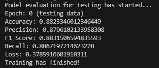

This project was started on 3rd June 2025. The goal of this project is to create a discriminative model capable of distinguishing in between AI generated images and non-AI generated images.

The dataset will not be backed to GitHub, but instead here is the link to the dataset:
https://www.kaggle.com/datasets/alessandrasala79/ai-vs-human-generated-dataset

This CNN was able to achieve the following statistics:
